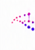
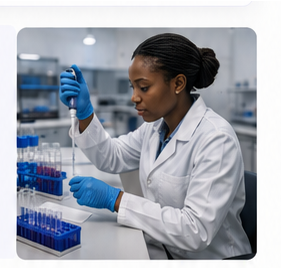
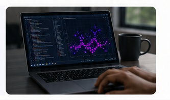
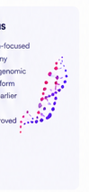

<!DOCTYPE html>
<html lang="en">
<head>
  <meta charset="UTF-8">
  <meta name="viewport" content="width=device-width, initial-scale=1.0">
  <meta name="description" content="GeneHus — AI-powered genomic diagnostics for earlier cancer detection across Africa.">
  <title>GeneHus | AI-Powered Genomic Diagnostics</title>
  <link rel="preconnect" href="https://fonts.googleapis.com">
  <link rel="preconnect" href="https://fonts.gstatic.com" crossorigin>
  <link href="https://fonts.googleapis.com/css2?family=Inter:wght@400;500;600;700;800&family=Lora:wght@600;700&display=swap" rel="stylesheet">
  <link rel="stylesheet" href="style.css">
</head>
<body>

<svg width="0" height="0" aria-hidden="true" style="position:absolute">
  <defs>
    <linearGradient id="iconGrad" x1="0%" y1="0%" x2="0%" y2="100%">
      <stop offset="0%" stop-color="#e91e8c"/>
      <stop offset="100%" stop-color="#6a1b9a"/>
    </linearGradient>
    <linearGradient id="logoGrad" x1="0%" y1="0%" x2="100%" y2="0%">
      <stop offset="0%" stop-color="#e91e8c"/>
      <stop offset="100%" stop-color="#6a1b9a"/>
    </linearGradient>
  </defs>
</svg>

<!-- NAV: man_1 layout + man_2 logo -->
<header class="site-header">
  

    <a class="logo" href="#hero">
      
      

        GeneHus
        AI-Powered Genomic Diagnostics
      

    </a>

    <nav class="nav-main" aria-label="Main navigation">
      <a class="active" href="#hero">Hero</a>
      <a href="#problem">Problem</a>
      <a href="#solution">Our Solution</a>
      <a href="#technology">Technology</a>
      <a href="#why-it-matters">Why It Matters</a>
      <a href="#about">About GeneHus</a>
      <a href="#team">Team</a>
      <a href="#advisors">Advisors</a>
      <a href="#partners">Partners &amp; Affiliations</a>
      <a href="#contact">Contact</a>
    </nav>

    <button type="button" class="btn btn-grad nav-cta">Learn More</button>
    <button class="menu-toggle" type="button" aria-label="Open menu" aria-expanded="false">&#9776;</button>
  

</header>

<!-- HERO: man_3 photo + page copy -->
<section class="hero" id="hero">
  

    

      

        AI-POWERED GENOMIC DIAGNOSTICS
        <h1>AI-Powered Cancer Insights, Earlier</h1>
        
GeneHus combines artificial intelligence and genomics to identify biomarkers and stratify cancer risk earlier and more accurately empowering clinicians and researchers across Africa.

        <button type="button" class="btn btn-grad">Learn More</button>
      

      <figure class="hero-visual">
        
      </figure>
    

    

      

        

          <svg width="18" height="18" viewBox="0 0 24 24" fill="none" stroke="#d6188a" stroke-width="2"><circle cx="12" cy="12" r="9"/><circle cx="12" cy="12" r="3"/></svg>
        

        

          <h4>AI-Powered Analysis</h4>
          
Advanced machine learning for genomic insights.

        

      

      

        

          <svg width="18" height="18" viewBox="0 0 24 24" fill="none" stroke="#8b1fc9" stroke-width="2"><path d="M4 4c4 0 4 4 8 4s4-4 8-4M4 12c4 0 4 4 8 4s4-4 8-4M4 20c4 0 4-4 8-4s4 4 8 4"/></svg>
        

        

          <h4>Genomic Data Intelligence</h4>
          
Analyzing genomic data to identify meaningful biomarkers.

        

      

      

        

          <svg width="18" height="18" viewBox="0 0 24 24" fill="none" stroke="#6d28d9" stroke-width="2"><path d="M12 3l7 3v6c0 5-3 8-7 9-4-1-7-4-7-9V6l7-3z"/></svg>
        

        

          <h4>Focused on Africa</h4>
          
Building solutions relevant to African populations.

        

      

    

  

</section>

<!-- WHY IT MATTERS: man_4 -->
<section class="why-band" id="why-it-matters">
  

    <h2>Why It Matters</h2>
    

      <article class="why-item">
        

          <svg width="28" height="28" viewBox="0 0 24 24" fill="url(#iconGrad)"><circle cx="9" cy="8" r="3.2"/><circle cx="16" cy="9" r="2.6" opacity="0.75"/><path d="M3 20c0-3.3 2.7-5.5 6-5.5s6 2.2 6 5.5"/><path d="M14 14.7c2.6.3 4.5 2.2 4.5 5.3" opacity="0.75"/></svg>
        

        

          <h4>Early Detection</h4>
          
Supporting research into earlier cancer insights.

        

      </article>
      <article class="why-item">
        

          <svg width="28" height="28" viewBox="0 0 24 24" fill="none" stroke="url(#iconGrad)" stroke-width="1.8"><circle cx="12" cy="12" r="8"/><circle cx="12" cy="12" r="3.2"/><path d="M9 15l3 2 3-2"/></svg>
        

        

          <h4>Precision Insights</h4>
          
Using genomic data analysis to identify meaningful biomarkers.

        

      </article>
      <article class="why-item">
        

          <svg width="28" height="28" viewBox="0 0 24 24" fill="none"><rect x="4" y="13" width="3.5" height="7" fill="url(#iconGrad)"/><rect x="10.3" y="9" width="3.5" height="11" fill="url(#iconGrad)" opacity="0.8"/><rect x="16.6" y="4" width="3.5" height="16" fill="url(#iconGrad)" opacity="0.6"/></svg>
        

        

          <h4>Better Outcomes</h4>
          
Supporting future precision medicine approaches.

        

      </article>
      <article class="why-item">
        

          <svg width="28" height="28" viewBox="0 0 24 24" fill="none" stroke="url(#iconGrad)" stroke-width="1.6"><circle cx="12" cy="12" r="9"/><ellipse cx="12" cy="12" rx="4" ry="9"/><line x1="3" y1="12" x2="21" y2="12"/></svg>
        

        

          <h4>Accessible Solutions</h4>
          
Developing solutions relevant to African populations.

        

      </article>
    

  

</section>

<!-- PROBLEM: man_5 photo -->
<section class="problem" id="problem">
  

    

      

        THE PROBLEM
        <h2>Prostate Cancer Outcomes in Africa Are Disproportionately Poor</h2>
        <ul>
          <li>Late-stage diagnosis remains common</li>
          <li>Limited genomic diagnostics access</li>
          <li>PSA testing alone has low specificity</li>
          <li>Existing AI/genomic tools underrepresent African populations</li>
        </ul>
        
African men experience some of the highest prostate cancer mortality rates globally.

      

      <figure class="problem-image">
        
        

          

            <svg width="20" height="20" viewBox="0 0 24 24" fill="none" stroke="#6d28d9" stroke-width="2" aria-hidden="true"><circle cx="12" cy="12" r="9"/><path d="M12 7v5l4 2"/></svg>
            Late Diagnosis
          

          &rarr;
          

            <svg width="20" height="20" viewBox="0 0 24 24" fill="none" stroke="#8b1fc9" stroke-width="2" aria-hidden="true"><rect x="4" y="5" width="16" height="16" rx="2"/><line x1="4" y1="10" x2="20" y2="10"/><line x1="8" y1="3" x2="8" y2="7"/><line x1="16" y1="3" x2="16" y2="7"/></svg>
            Delayed Intervention
          

          &rarr;
          

            <svg width="20" height="20" viewBox="0 0 24 24" fill="none" aria-hidden="true"><rect x="3" y="13" width="3.4" height="7" fill="#d6188a"/><rect x="9.3" y="9" width="3.4" height="11" fill="#8b1fc9"/><rect x="15.6" y="4" width="3.4" height="16" fill="#6d28d9"/></svg>
            High Mortality
          

        

      </figure>
    

  

</section>

<!-- SOLUTION: man_7 photo -->
<section class="solution" id="solution">
  

    

      

        OUR SOLUTION
        <h2>GeneHus Clinical Intelligence Platform</h2>
        
AI-powered genomic risk stratification for African oncology systems.

        

          <article class="feature-card">
            

              <svg width="18" height="18" viewBox="0 0 24 24" fill="none" stroke="#8b1fc9" stroke-width="2"><ellipse cx="12" cy="6" rx="8" ry="3"/><path d="M4 6v6c0 1.6 3.6 3 8 3s8-1.4 8-3V6"/><path d="M4 12v6c0 1.6 3.6 3 8 3s8-1.4 8-3v-6"/></svg>
            

            <h4>Integrates Genomic + Clinical Data</h4>
            
Combines genomic, clinical, and pathology data for deeper insights.

          </article>
          <article class="feature-card">
            

              <svg width="18" height="18" viewBox="0 0 24 24" fill="none" stroke="#8b1fc9" stroke-width="2"><path d="M9 3a3 3 0 0 0-3 3 3 3 0 0 0-2 5 3 3 0 0 0 2 5 3 3 0 0 0 3 3h0V3z"/><path d="M15 3a3 3 0 0 1 3 3 3 3 0 0 1 2 5 3 3 0 0 1-2 5 3 3 0 0 1-3 3h0V3z"/></svg>
            

            <h4>AI Risk Stratification</h4>
            
Proprietary AI models predict cancer risk and prognosis with greater accuracy.

          </article>
          <article class="feature-card">
            

              <svg width="18" height="18" viewBox="0 0 24 24" fill="none" stroke="#8b1fc9" stroke-width="2"><rect x="3" y="4" width="18" height="13" rx="2"/><path d="M8 21h8M12 17v4"/><path d="M7 13l3-3 2 2 4-5"/></svg>
            

            <h4>Clinician Dashboard</h4>
            
Actionable insights in an intuitive dashboard designed for real-world workflows.

          </article>
          <article class="feature-card">
            

              <svg width="18" height="18" viewBox="0 0 24 24" fill="none" stroke="#8b1fc9" stroke-width="2"><path d="M12 3l7 3v6c0 5-3 8-7 9-4-1-7-4-7-9V6l7-3z"/><path d="M9 12l2 2 4-4"/></svg>
            

            <h4>Improved Outcomes, Lower Costs</h4>
            
Enables earlier intervention, better outcomes, and more efficient use of resources.

          </article>
        

      

      <figure class="solution-image">
        
      </figure>
    

    <!-- TECHNOLOGY: man_8 photo -->
    

      

        TECHNOLOGY
        <h2>Built for African Healthcare Ecosystems</h2>
        
GeneHus is a cloud-native platform that brings together genomics, AI, and clinical data to deliver precision oncology insights—designed for low-resource settings.

        

          <article class="tech-item">
            

              <svg width="16" height="16" viewBox="0 0 24 24" fill="none" stroke="#6d28d9" stroke-width="2"><path d="M7 18a4 4 0 0 1-1-7.9A5 5 0 0 1 16 8a4.5 4.5 0 0 1 1 9z"/></svg>
            

            
<h4>Cloud-Native Architecture</h4>
Secure, scalable, and built for reliability.

          </article>
          <article class="tech-item">
            

              <svg width="16" height="16" viewBox="0 0 24 24" fill="none" stroke="#6d28d9" stroke-width="2"><path d="M9 3a3 3 0 0 0-3 3 3 3 0 0 0-2 5 3 3 0 0 0 2 5 3 3 0 0 0 3 3h0V3z"/><path d="M15 3a3 3 0 0 1 3 3 3 3 0 0 1 2 5 3 3 0 0 1-2 5 3 3 0 0 1-3 3h0V3z"/></svg>
            

            
<h4>AI &amp; Machine Learning</h4>
Advanced models for risk prediction and biomarker identification.

          </article>
          <article class="tech-item">
            

              <svg width="16" height="16" viewBox="0 0 24 24" fill="none" stroke="#6d28d9" stroke-width="2"><rect x="3" y="4" width="8" height="6" rx="1"/><rect x="13" y="4" width="8" height="6" rx="1"/><path d="M7 10v4m10-4v4M7 14h10v3H7z"/></svg>
            

            
<h4>Interoperable Systems</h4>
Seamless integration with hospital systems and laboratory workflows.

          </article>
          <article class="tech-item">
            

              <svg width="16" height="16" viewBox="0 0 24 24" fill="none" stroke="#6d28d9" stroke-width="2"><path d="M12 3l7 3v6c0 5-3 8-7 9-4-1-7-4-7-9V6l7-3z"/><path d="M9 12l2 2 4-4"/></svg>
            

            
<h4>Privacy &amp; Security by Design</h4>
Patient data protection and compliance at the core.

          </article>
        

      

      <figure class="tech-image">
        
      </figure>
    

  

</section>

<!-- IMPACT -->
<section class="impact" id="impact">
  <svg class="impact-bg" viewBox="0 0 1180 320" preserveAspectRatio="xMidYMid slice" xmlns="http://www.w3.org/2000/svg" aria-hidden="true">
    <g stroke="url(#iconGrad)" stroke-width="2" fill="none" opacity="0.5">
      <path d="M40 0 C 90 50, 10 90, 60 140 C 110 190, 10 230, 60 320"/>
      <path d="M110 0 C 60 50, 140 90, 90 140 C 40 190, 140 230, 90 320"/>
    </g>
  </svg>
  

    <h2>Our Impact</h2>
    
Building the foundation for precision oncology across Africa.

    

      <article class="impact-item">
        

          <svg width="26" height="26" viewBox="0 0 24 24" fill="none" stroke="#fff" stroke-width="1.6"><circle cx="12" cy="8" r="3.4"/><path d="M5 21c0-3.6 3-6.5 7-6.5s7 2.9 7 6.5"/></svg>
        

        
<h4>Earlier Detection</h4>
Enabling earlier cancer risk identification.

      </article>
      <article class="impact-item">
        

          <svg width="26" height="26" viewBox="0 0 24 24" fill="none" stroke="#fff" stroke-width="1.6"><circle cx="12" cy="12" r="3"/><circle cx="5" cy="6" r="1.4"/><circle cx="19" cy="6" r="1.4"/><circle cx="5" cy="18" r="1.4"/><circle cx="19" cy="18" r="1.4"/></svg>
        

        
<h4>Data for Africans</h4>
Building African genomic datasets for better accuracy.

      </article>
      <article class="impact-item">
        

          <svg width="26" height="26" viewBox="0 0 24 24" fill="none" stroke="#fff" stroke-width="1.6"><circle cx="12" cy="12" r="9"/><circle cx="12" cy="12" r="4.5"/><circle cx="12" cy="12" r="1"/></svg>
        

        
<h4>Better Outcomes</h4>
Supporting clinicians to make more informed decisions.

      </article>
      <article class="impact-item">
        

          <svg width="26" height="26" viewBox="0 0 24 24" fill="none" stroke="#fff" stroke-width="1.6"><circle cx="12" cy="12" r="3"/><path d="M12 2v4M12 18v4M2 12h4M18 12h4"/></svg>
        

        
<h4>Equitable Access</h4>
Bridging the gap in precision oncology across the continent.

      </article>
    

  

</section>

<!-- INFO CARDS: man_9, man_10, man_11, man_12 content -->
<section class="info-band">
  

    

      <!-- man_9 -->
      <article class="info-card about-card" id="about">
        

          

            <h3>About GeneHus</h3>
            
GeneHus is an African-focused biotechnology company building AI-powered genomic infrastructure to transform cancer care through earlier detection, better risk stratification, and improved clinical outcomes.

          

          
        

      </article>

      <!-- man_10 -->
      <article class="info-card" id="team">
        <h3>Our Team</h3>
        
A passionate team of scientists, engineers, and innovators committed to advancing precision medicine in Africa.

        <figure class="info-photo">
          
        </figure>
        <a class="pill-btn" href="#team">Meet the Team &rarr;</a>
      </article>

      <!-- man_11 -->
      <article class="info-card" id="advisors">
        <h3>Advisors</h3>
        
Guided by experts in genomics, oncology, AI, and healthcare.

        <figure class="info-photo">
          
        </figure>
        <a class="pill-btn" href="#advisors">Meet Our Advisors &rarr;</a>
      </article>

      <!-- man_12 -->
      <article class="info-card partners-card" id="partners">
        <h3>Partners &amp; Affiliations</h3>
        
Collaborating with leading institutions and organizations that share our mission.

        

          

            
            

              <strong>UG</strong>
              University of Ghana
            

          

          

            
            

              <strong>KCCR</strong>
              Kumasi Centre for Collaborative Research in Tropical Medicine
            

          

          

            
            

              <strong>NMIMR</strong>
              Noguchi Memorial Institute for Medical Research
            

          

          

            
            

              <strong>AORTIC</strong>
              Africa Organization for Research &amp; Training in Cancer
            

          

        

        <a class="pill-btn" href="#partners">Our Partners &rarr;</a>
      </article>

    

  

</section>

<!-- CTA -->

  

    

      

        

          <svg width="22" height="22" viewBox="0 0 24 24" fill="none" stroke="#c62828" stroke-width="1.8"><rect x="3" y="7" width="18" height="13" rx="2"/><path d="M8 7V5a2 2 0 0 1 2-2h4a2 2 0 0 1 2 2v2"/><line x1="3" y1="12" x2="21" y2="12"/></svg>
        

        

          <h3>Ready to Transform Cancer Care in Africa?</h3>
          
Partner with GeneHus to build a future of earlier detection, personalized treatment, and better outcomes.

        

      

      <button type="button" class="btn btn-white">Learn More</button>
    

  

<!-- FOOTER -->
<footer>
  

    

      

        <a class="logo logo--footer" href="#hero">
          
          GeneHus
        </a>
        
AI-Powered Genomic Diagnostics for Africa.

        

          <a class="social-dot" href="https://linkedin.com" aria-label="LinkedIn">in</a>
          <a class="social-dot" href="https://twitter.com" aria-label="Twitter">X</a>
          <a class="social-dot" href="mailto:hello@genehus.bio" aria-label="Email">@</a>
        

      

      

        <h5>Quick Links</h5>
        <a href="#hero">Hero</a>
        <a href="#problem">Problem</a>
        <a href="#solution">Our Solution</a>
        <a href="#technology">Technology</a>
        <a href="#why-it-matters">Why It Matters</a>
      

      

        <h5>About GeneHus</h5>
        <a href="#team">Team</a>
        <a href="#advisors">Advisors</a>
        <a href="#partners">Partners &amp; Affiliations</a>
        <a href="#contact">Contact</a>
      

      

        <h5>Contact</h5>
        
&#9993; hello@genehus.bio

        
&#127760; genehus.bio

        
&#128205; Accra, Ghana

        <h5 class="mt">Stay Connected</h5>
        
Join our newsletter for updates on our progress and impact.

        

          <input type="email" placeholder="Enter your email" aria-label="Email address">
          <button type="button" aria-label="Subscribe">&rarr;</button>
        

      

    

    

      &copy; 2024 GeneHus. All rights reserved.
      Building precision oncology infrastructure for African healthcare systems.
    

  

</footer>

</body>
</html>
